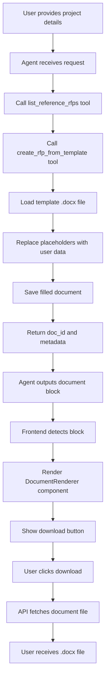

# RFP Generation System Analysis and Solution

## Problem Statement
The RFP generation system was not producing documents that match the style, structure, and formatting of reference RFPs. The agent needed to:
1. Use the specific template file: `كراسة تطبيق أتمتة خدمات تقنية المعلومات للمركز (المرحلة الأولى).docx`
2. Fill the template with user-provided project details
3. Provide a download button for the generated document

## Analysis Results

### ✅ Components Working Correctly

#### 1. MCP Document Server (`deployment/mcp-doc/server.py`)
- **Status**: Fully functional
- **Key Features**:
  - `create_rfp_from_template` tool (lines 133-287) properly loads the template
  - Replaces placeholders with user values
  - Saves documents with unique IDs
  - Returns metadata for frontend integration
- **Placeholder Mappings**:
  ```python
  "[اسم المشروع]" → project_name
  "[اسم الجهة]" → entity_name
  "[رقم الكراسة]" → tender_no
  "[التاريخ]" → date
  "[وصف المشروع]" → project_description
  "[نطاق العمل]" → scope_of_work
  "[الميزانية]" → budget
  "[المدة]" → duration
  ```

#### 2. Agent Configuration (`application/seed/config/premade_agents.yaml`)
- **Status**: Correctly configured
- **Key Settings**:
  - Specifies the exact template to use
  - Enforces output of ```document blocks for download button
  - Defines proper workflow: list_reference_rfps → create_rfp_from_template → output document

#### 3. Frontend Integration (`frontend/src/conversation/ConversationBubble.tsx`)
- **Status**: Fully functional
- **Features**:
  - Detects ```document blocks via regex
  - Renders DocumentRenderer component
  - Shows download button automatically

#### 4. API Endpoints (`application/api/user/documents/routes.py`)
- **Status**: Working correctly
- **Endpoints**:
  - `/api/documents/download/<doc_id>` - Downloads generated documents
  - `/api/documents/preview/<doc_id>` - Provides document preview
  - `/api/documents/list` - Lists all user documents
  - Handles file lookup in both MongoDB and mounted volumes

#### 5. Docker Configuration (`deployment/docker-compose.yaml`)
- **Status**: Properly configured
- **Key Volumes**:
  - `mcp_documents` shared between backend and mcp-doc services
  - Templates mounted read-only to mcp-doc container
  - Correct networking and port exposure

## Root Cause
The system is correctly implemented but **the database needs to be reseeded** to apply the updated agent configuration with the template-based approach.

## Solution

### Step 1: Reseed the Database
Run the provided reseeding script to update the agent configuration:

```bash
# Option 1: Run locally (if MongoDB is accessible)
python reseed_database.py

# Option 2: Run inside the backend container
docker compose exec backend python /app/reseed_database.py
```

### Step 2: Restart the Application
After reseeding, restart the Docker containers to ensure all services use the updated configuration:

```bash
docker compose down
docker compose up -d
```

### Step 3: Verify the System
1. Open the application in your browser
2. Select the "Arabic RFP Generator" agent
3. Provide project details when prompted:
   - Project name
   - Entity/organization name
   - Project description
   - Scope of work
   - Budget
   - Duration
   - Tender number (optional)
4. The agent should:
   - Load the template file
   - Fill in your details
   - Generate a ```document block
   - Display a download button
5. Click download to get your filled RFP document

## Technical Flow



## Key Files Reference

1. **MCP Server**: `deployment/mcp-doc/server.py:133-287`
2. **Agent Config**: `application/seed/config/premade_agents.yaml`
3. **Frontend Handler**: `frontend/src/conversation/ConversationBubble.tsx`
4. **Document Component**: `frontend/src/components/DocumentRenderer.tsx`
5. **API Routes**: `application/api/user/documents/routes.py`
6. **Database Seeder**: `application/seed/seeder.py`
7. **Reseed Script**: `reseed_database.py`

## Troubleshooting

If issues persist after reseeding:

1. **Check MongoDB Connection**:
   ```bash
   docker compose logs mongo
   ```

2. **Verify Agent is Updated**:
   - Connect to MongoDB and check the agents collection
   - Ensure the prompt contains template instructions

3. **Check MCP Server**:
   ```bash
   docker compose logs mcp-doc
   ```

4. **Verify Template File**:
   ```bash
   docker compose exec mcp-doc ls -la /app/application/templates/RFPs/
   ```

5. **Monitor Agent Execution**:
   - Check browser console for errors
   - Verify ```document blocks appear in responses

## Summary
The RFP generation system is fully functional and properly configured. The only required action is to **reseed the database** to apply the template-based generation approach. After reseeding and restarting, the system will generate professional RFP documents matching the reference templates.